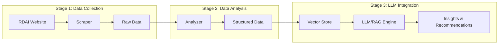

# Insurance Helper Bot

A complete end-to-end pipeline for scraping, analyzing, and querying insurance product data from the Insurance Regulatory and Development Authority of India (IRDAI). The system collects insurance product metadata and policy documents, transforms them into structured formats for analysis, and provides LLM-powered insights through a RAG (Retrieval-Augmented Generation) system.

## Problem Statement

Navigating India's insurance landscape is challenging:
- **Information Overload**: IRDAI lists 8,500+ insurance products across life, health, and non-life categories
- **Scattered Data**: Policy documents are spread across multiple pages with inconsistent formats
- **Complex Comparison**: Comparing policies requires manually downloading and reading lengthy PDF documents
- **No Unified Search**: There's no way to query across all products to find the best fit for specific needs

This project aims to solve these problems by creating an intelligent assistant that can help users understand, compare, and choose insurance products.

## Pipeline Architecture



## Pipeline Stages

### Stage 1: Data Collection (Implemented)

The scraper collects comprehensive metadata and policy documents from IRDAI's official website.

**What It Does:**
- Crawls 4 different IRDAI product listing pages
- Extracts metadata for ~8,500 insurance products
- Downloads associated PDF/XLSX policy documents
- Maintains state for resumable scraping sessions

**Features:**
- Parallel async downloads for high throughput
- CSV export with complete product metadata
- Resume capability with JSON state tracking
- Progress bars and real-time status reporting
- Configurable concurrency and page ranges

**Data Collected:**

| Page | URL | Records | File Type | Data Points |
|------|-----|---------|-----------|-------------|
| Life Insurance Products | `/life-insurance-products` | ~1,500 | PDF | UIN, insurer, product type, launch date, par/non-par status, individual/group |
| List of Life Products | `/list-of-life-products` | ~27 | XLSX | Product descriptions, last updated dates |
| Non-Life Insurance Products | `/non-life-insurance-products` | ~5,200 | PDF | UIN, insurer, product type, approval date |
| Health Insurance Products | `/health-insurance-products` | ~1,800 | PDF | UIN, insurer, product name, approval date |

### Stage 2: Data Analysis (Coming Soon)

Transforms raw scraped data into structured, queryable formats suitable for LLM consumption.

**Planned Components:**

1. **PDF Parser**
   - Extract text content from policy documents
   - Handle multi-column layouts and tables
   - OCR support for scanned documents
   - Preserve document structure and hierarchy

2. **Data Normalizer**
   - Standardize insurer names and product categories
   - Normalize dates, amounts, and coverage terms
   - Map product types to unified taxonomy
   - Handle missing or inconsistent data

3. **Feature Extractor**
   - Identify key policy terms (premium, coverage, exclusions)
   - Extract coverage limits and claim procedures
   - Parse waiting periods and policy conditions
   - Identify riders and add-on options

4. **Schema Builder**
   - Create structured JSON/database records
   - Build relationships between products and insurers
   - Generate embeddings for semantic search
   - Index documents for fast retrieval

### Stage 3: LLM-Powered Insights (Coming Soon)

RAG-based system for intelligent querying and analysis of insurance products.

**Architecture:**
- Vector database for semantic document storage
- Embedding model for document and query vectorization
- LLM for natural language understanding and generation
- Retrieval pipeline for context-aware responses

**Planned Use Cases:**

1. **Policy Comparison**
   - Compare multiple insurance policies side-by-side
   - Highlight key differences in coverage, premiums, and terms
   - Generate comparison tables and summaries
   - Identify best value options for specific criteria

2. **Product Recommendations**
   - Understand user requirements through conversational interface
   - Match needs to suitable insurance products
   - Explain why specific products are recommended
   - Consider factors like age, health, budget, and coverage needs

3. **Policy Q&A**
   - Answer specific questions about any insurance product
   - Explain complex terms and conditions in simple language
   - Clarify exclusions and waiting periods
   - Provide claim procedure guidance

4. **Regulatory Insights**
   - Track policy approvals and withdrawals over time
   - Identify trends in insurance product offerings
   - Monitor insurer product portfolios
   - Analyze market coverage gaps

## Installation

Requires Python 3.11+ and [uv](https://docs.astral.sh/uv/).

```bash
# Clone the repository
git clone https://github.com/EXTREMOPHILARUM/insurance-helper.git
cd insurance-helper

# Install dependencies
uv sync
```

## Usage

### Scrape All Products

```bash
# Scrape all pages (metadata + files)
uv run irdai-scraper scrape --type all

# Scrape specific product type
uv run irdai-scraper scrape --type life
uv run irdai-scraper scrape --type life_list
uv run irdai-scraper scrape --type nonlife
uv run irdai-scraper scrape --type health
```

### Options

```bash
# Metadata only (no file downloads)
uv run irdai-scraper scrape --type all --metadata-only

# Custom concurrency (default: 10)
uv run irdai-scraper scrape --type all --concurrent 20

# Scrape specific page range (for testing)
uv run irdai-scraper scrape --type life --start-page 1 --end-page 5

# Start fresh (ignore previous progress)
uv run irdai-scraper scrape --type all --no-resume

# Custom output directory
uv run irdai-scraper scrape --type all --output ./my-data
```

### Other Commands

```bash
# Check scraping status
uv run irdai-scraper status

# Retry failed downloads
uv run irdai-scraper retry-failed

# Reset progress for a specific type
uv run irdai-scraper reset --type life

# Reset all progress
uv run irdai-scraper reset --yes
```

## Output Structure

```
data/
├── metadata/
│   ├── life_insurance_products.csv      # Life insurance product metadata
│   ├── life_products_list.csv           # Life products list metadata
│   ├── nonlife_insurance_products.csv   # Non-life product metadata
│   └── health_insurance_products.csv    # Health product metadata
├── downloads/
│   ├── life/                            # Life insurance PDFs
│   │   └── {FY}/{Insurer}/{UIN}_{ProductName}.pdf
│   ├── life_list/                       # Life products XLSX files
│   │   └── {filename}.xlsx
│   ├── nonlife/                         # Non-life insurance PDFs
│   │   └── {FY}/{Insurer}/{UIN}_{ProductName}.pdf
│   └── health/                          # Health insurance PDFs
│       └── {FY}/{Insurer}/{UIN}_{ProductName}.pdf
└── state.json                           # Scraping progress state
```

### CSV Schema

**Life Insurance Products:**
| Column | Description |
|--------|-------------|
| archive_status | Whether product is archived |
| financial_year | FY of product launch/modification |
| insurer | Insurance company name |
| product_name | Name of the insurance product |
| uin | Unique Identification Number |
| type_of_product | Product category |
| launch_modification_date | Date of launch or last modification |
| closing_withdrawal_date | Product withdrawal date (if applicable) |
| protection_savings_retirement | Product classification |
| par_nonpar | Participating or Non-participating |
| individual_group | Individual or Group product |
| remarks | Additional notes |
| document_url | URL to policy document |
| document_filename | Downloaded filename |
| local_file_path | Path to downloaded file |

**Non-Life Insurance Products:**
| Column | Description |
|--------|-------------|
| s_no | Serial number |
| financial_year | FY of approval |
| insurer | Insurance company name |
| product_name | Name of the insurance product |
| type_of_product | Product category |
| uin | Unique Identification Number |
| date_of_approval | IRDAI approval date |
| document_url | URL to policy document |
| document_filename | Downloaded filename |
| local_file_path | Path to downloaded file |
| archive_status | Whether product is archived |

**Health Insurance Products:**
| Column | Description |
|--------|-------------|
| financial_year | FY of approval |
| insurer | Insurance company name |
| uin | Unique Identification Number |
| product_name | Name of the insurance product |
| date_of_approval | IRDAI approval date |
| document_url | URL to policy document |
| document_filename | Downloaded filename |
| local_file_path | Path to downloaded file |
| type_of_product | Product category |
| archive_status | Whether product is archived |

**List of Life Products:**
| Column | Description |
|--------|-------------|
| archive_status | Whether entry is archived |
| short_description | Brief product description |
| last_updated | Last update timestamp |
| sub_title | Additional title/category |
| document_url | URL to document |
| document_filename | Downloaded filename |
| local_file_path | Path to downloaded file |

## Resume Capability

The scraper maintains progress state in `data/state.json`:
- Tracks completed pages for each product type
- Records successfully downloaded files
- Logs failed downloads for retry
- Enables interruption and resumption without data loss

## Roadmap

- [x] **Stage 1: Data Collection**
  - [x] IRDAI website scraper
  - [x] Metadata extraction
  - [x] Document downloads
  - [x] Resume capability

- [ ] **Stage 2: Data Analysis**
  - [ ] PDF text extraction
  - [ ] Data normalization
  - [ ] Feature extraction
  - [ ] Structured schema creation

- [ ] **Stage 3: LLM Integration**
  - [ ] Vector database setup
  - [ ] Document embedding
  - [ ] RAG pipeline
  - [ ] Conversational interface

## Technical Notes

- SSL verification is disabled due to IRDAI certificate issues
- Estimated runtime: ~2.5 hours for all files (10 concurrent downloads)
- With 20 concurrent downloads: ~1.2 hours
- Total data size: ~15-20 GB (all PDFs and metadata)

## License

MIT
